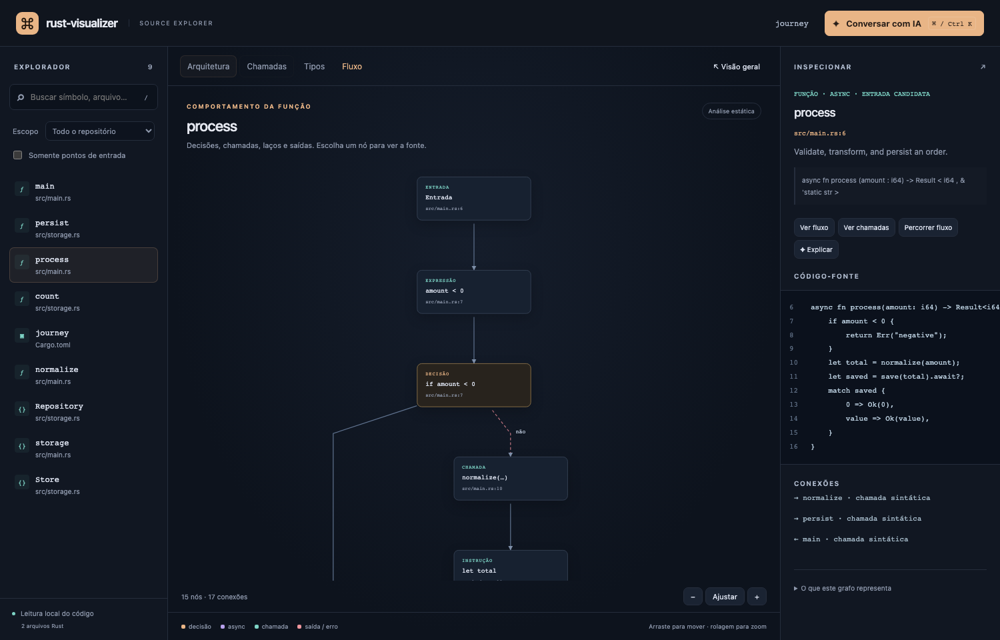

# rust-visualizer

Explore how a Rust program is put together—and how control moves through it.

One executable contains the analyzer, local server, HTML, JavaScript, CSS, graph layout,
and protobuf bindings. The analyzed repository needs no plugin, toolchain, Node.js,
network access, nightly Rust, or build step. Interface language: Brazilian Portuguese.



## Install

Install or update to the **latest release** with one command:

```sh
curl -fsSL https://raw.githubusercontent.com/gu1p/rust-visualizer/main/install.sh | sh
```

The installer detects Linux/macOS and Intel/AMD/ARM64, verifies the release's SHA-256
checksum, and installs to `~/.local/bin` without `sudo`. Run the same command to update.
If that directory is not on your `PATH`, add it to your shell configuration or launch
`~/.local/bin/rust-visualizer` directly. To choose another directory, pass
`RV_INSTALL_DIR=/your/bin` to `sh`. The installer never edits shell configuration.
You can [inspect the installer](install.sh) before running it.

For manual installation, download your platform's archive from [Releases](https://github.com/gu1p/rust-visualizer/releases):

| Platform | Archive suffix |
| --- | --- |
| Linux Intel/AMD | `x86_64-unknown-linux-musl.tar.gz` |
| Linux ARM64 | `aarch64-unknown-linux-musl.tar.gz` |
| macOS Intel | `x86_64-apple-darwin.tar.gz` |
| macOS Apple Silicon | `aarch64-apple-darwin.tar.gz` |

Verify against the release's `SHA256SUMS`, extract the archive, and place `rust-visualizer`
on your PATH. Linux builds use musl. macOS builds are currently unsigned and not notarized.

```sh
rust-visualizer serve /path/to/repository
rust-visualizer export /path/to/repository --output ARCHITECTURE.html
```

With no arguments, the tool serves the current directory and opens a browser. Use
`--no-open` to print the URL without opening it; `--port 8080` selects a fixed port.
The default port is chosen automatically. Stop the server with Ctrl+C.
Export refuses to overwrite an existing file unless `--force` is supplied.

The HTML export is a complete, offline snapshot with no companion files or CDN requests.
AI chat is available through `serve`, where credentials remain in the Rust process.
Restart or export again after changing the source; snapshots do not watch files yet.

## Explore the program

- **Architecture:** drill into crates and inline modules; inspect package dependencies.
- **Calls:** explore callers and callees around a function, expanding its neighborhood.
- **Types:** inspect structs, enums, traits, implementations, and simple field references.
- **Flow:** examine evaluation order, conditions, match arms, loops, return paths, `?`,
  `.await`, and deferred closure/async boundaries.
- **Source:** select a node to inspect its code and highlighted source lines.
- **Walkthrough:** choose branches in a possible path, with previous/next navigation.

Search names, lexical paths, and files. Filter by crate or entry-point candidates.
Press `/` for search, **Cmd+K / Ctrl+K** for the AI dialog, and Escape to close it.
Graph nodes are keyboard-accessible buttons. Focus the graph to pan with arrow keys,
zoom with `+` / `-`, or fit with `0`. Pointer dragging and scroll zoom are supported.

## Ask AI to explain and show

Configure one provider in the shell before starting the server:

```sh
export OPENAI_API_KEY='your-key'
rust-visualizer serve /path/to/repository
```

Or:

```sh
export OPENROUTER_API_KEY='your-key'
rust-visualizer serve /path/to/repository
```

| Variable | Purpose |
| --- | --- |
| `OPENAI_API_KEY` | OpenAI credential |
| `OPENROUTER_API_KEY` | OpenRouter credential |
| `RV_AI_PROVIDER` | Optional explicit `openai` or `openrouter`; OpenAI wins when both keys exist |
| `RV_AI_MODEL` | Override the model; must support strict JSON Schema structured output |
| `RV_AI_BASE_URL` | Optional compatible API base URL, such as `https://example.com/v1` |

Defaults are `gpt-4.1-mini` for OpenAI and `openai/gpt-4.1-mini` for OpenRouter. Model
availability depends on the provider/account; set `RV_AI_MODEL` when needed.
The tool does not automatically load `.env` files. Export variables in your shell.

Ask “Where does execution start?”, “Explain this function's error paths”, or “Show how
this input reaches persistence.” Select a function first to prioritize its source.

An answer includes plain text, validated node highlights, and an ordered graph tour.
Choose **Mostrar no grafo** to see the explanation on the graph. **Ouvir resposta** reads
the answer using browser/OS speech synthesis; voice availability and whether synthesis
is local depend on your browser. This is text-to-speech, not an audio-native model or
voice-input assistant. A transcript remains available.

The provider receives your question, bounded recent conversation, and a selected/search-ranked
subset of source and graph edges. Nothing is sent until you submit a question. The server
does not log prompts or keys, persist conversations, or send the key to the browser.
Read [the data and security model](docs/security.md) before using sensitive repositories.

Integration references: [OpenAI structured outputs](https://developers.openai.com/api/docs/guides/structured-outputs)
and [OpenRouter structured outputs](https://openrouter.ai/docs/guides/features/structured-outputs).

## What the graph can prove

This is **static syntax analysis**, not a debugger or recorded execution trace. It does not
run the repository, invoke Cargo, expand macros, evaluate `cfg`, infer receiver types,
or model scheduling and runtime values. All source configurations may appear together.

Lexically resolvable paths become call edges. Method/receiver and ambiguous calls remain
visible in function flow with an unresolved label. No target is guessed from a method
name. Public functions are entry-point *candidates*, not an effective-visibility analysis.
Closures and async blocks are represented as deferred bodies. Match guards appear on
arm labels; macro-generated code and opaque expressions are not expanded.

Module paths are inferred from conventional file layout and inline declarations. Custom
`#[path]`, unusual Cargo target paths, re-exports/glob imports, dependency renames across
packages, complex generic types, and dynamic dispatch are not fully resolved. Scanning
honors ignore rules, skips symlinks and generated directories, and reports parse errors.
Files are limited to 2 MiB each and source input to 64 MiB per scan.

For compiler-backed semantics, runtime traces, and richer retrieval, see the extension
points in [Architecture](docs/architecture.md). AI explanations are hypotheses grounded
in the provided source subset and should be checked against the displayed code.

## Build and contribute

Building the executable requires Rust stable (minimum 1.88) and Node.js 22+.
Protoc is supplied by the Rust build dependency; no system installation is needed.

```sh
npm ci
make proto-types
npx playwright install chromium
make check
make build
./target/release/rust-visualizer serve .
```

`make check` builds the embedded UI, checks Rust formatting and Clippy, runs Rust behavior,
unit and HTTP integration tests, typechecks TypeScript, tests release versioning and installation, runs
Playwright UI contracts, and checks file/function limits. Provider tests use local doubles
and do not need credentials or paid API calls. Follow [AGENTS.md](AGENTS.md) and strict TDD.
Generated protobuf bindings are committed; `make check-proto-types` detects schema drift.

## Automatic releases

Every successful push to `main` (including a merge) passes the complete check job before
building all four native binaries. Only after every build and smoke test succeeds does
the workflow publish a GitHub release with tarballs and SHA-256 checksums.

The patch version is `0.1.<workflow run number>`. It increases without version-bump commits
or a personal token; PR runs can leave gaps. The release tag and executable `--version`
agree. Reruns keep the same version and preserve already-published assets. `Cargo.toml`
retains the development baseline; CI embeds `RV_VERSION` in release executables.

The version/build/publish jobs share one workflow because [events created by `GITHUB_TOKEN`
generally do not start another workflow](https://docs.github.com/en/actions/how-tos/write-workflows/choose-when-workflows-run/trigger-a-workflow).
No Windows artifacts are produced.

## License

MIT. Third-party bundled JavaScript notices are in [THIRD_PARTY_NOTICES.md](THIRD_PARTY_NOTICES.md).
