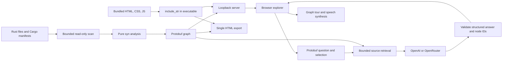

# Architecture

The implementation is standalone and reads the target repository without modifying it.
It was motivated by aleluia-os's `tools/docgraph`, but does not depend on that workspace.

## Boundaries

- `scan.rs` owns filesystem IO, ignore rules, input budgets, and manifest discovery.
- `repository.rs` attaches directory/file metadata and reparents top-level declarations
  under their source files, retaining crates at their actual directory locations.
- `analysis.rs`, `symbols.rs`, `resolve.rs`, and `flow*.rs` are pure source transformations.
- `proto/graph.proto` defines the snapshot and every Rust/browser message.
- `ai/context.rs` ranks selected nodes, neighbors, lexical matches, and entry points.
- `ai.rs` owns provider HTTP, environment configuration, timeouts, and credential handling.
- `ai/response.rs` is the only model-response JSON decoder and graph-action validator.
- `server.rs` serves fixed embedded assets and protobuf routes on a loopback listener.
- `export.rs` embeds base64 protobuf and the same bundled UI into one HTML file.
- `web/` implements accessible DOM graph cards, SVG edges, source inspection, chat, and tours.

The source parser records function-local control-flow nodes. Edges represent possible
syntactic continuations. A `return` connects to the function exit; a `?` has separate success
and early-exit edges; loops have back-edges and explicit labeled jump destinations.
Short-circuit operands have conditional paths. Calls to deferred bodies are not inlined.
An `await` marks suspension/resumption without predicting scheduler behavior.

Relationship resolution is conservative. It matches declaration paths and simple use aliases;
it does not infer dynamic receivers. Source locations and unresolved call sites are retained.
IDs include lexical identity, relative file, and span. Input discovery is sorted for stable exports.

The browser starts with a collapsed graph and a searchable file tree. `progressive.ts` is a
pure, tested visibility model: only explicitly expanded nodes reveal their immediate neighbors.
Flow starts at the function entry. AI/manual tours reveal their visited steps without expanding
the whole function. Rendering is capped at 160 nodes; file scoping, search, and crate filters
remain available. Node positions and camera preferences are kept in page memory per view/scope.
Dragging updates connected SVG paths in graph coordinates, independently of canvas panning.
All JavaScript and colorful SVG icons are embedded, with no CDN runtime.

## Extension points

1. Add an optional rust-analyzer/SCIP input adapter that contributes compiler-backed
   call targets with explicit evidence/provenance, preserving the portable syntax baseline.
2. Introduce a separate protobuf runtime-event stream for actual traces. Keep observed
   execution distinct from possible static paths and AI-authored explanations.
3. Add provider tool requests for iterative source retrieval, with per-request budgets
   and allowlisted graph/source operations. The current provider receives one bounded context.
4. Add native audio providers and synchronized narration as separate adapters. The current
   audio path is browser speech synthesis with visible text and explicit playback controls.

These are extension points, not features advertised as already implemented.
